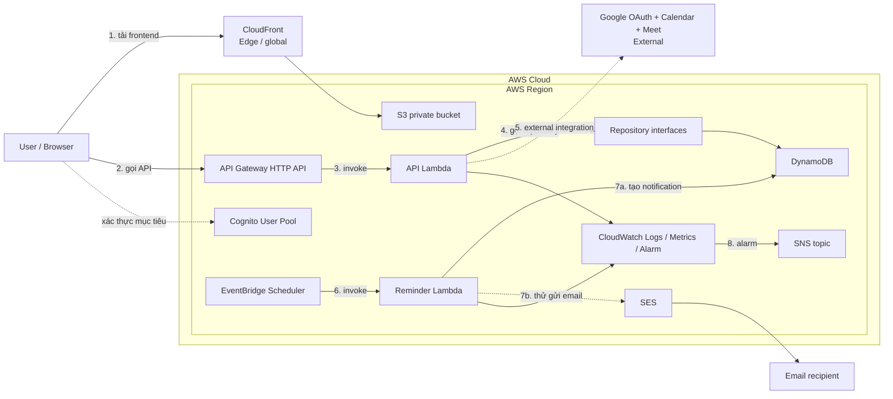

# Kiến trúc CampusMeet

## Trạng thái hiện tại

Repository mới có application shell, mock data, shared contracts, Lambda handler skeleton và AWS SAM skeleton. Chỉ `GET /health` có xử lý thật ở mức tối thiểu; API nghiệp vụ, Cognito, DynamoDB, Google, reminder và email chưa được kết nối. Chưa có AWS resource nào được deploy.

## Kiến trúc mục tiêu

Luồng chính:

1. Browser tải static frontend qua CloudFront và S3 private.
2. Browser gọi API Gateway bằng token Cognito ở giai đoạn triển khai thật.
3. API Gateway gọi API Lambda.
4. Lambda gọi repository interface; adapter DynamoDB thật chưa tồn tại.
5. Google Calendar/Meet là external integration qua adapter tương lai.
6. EventBridge Scheduler gọi Reminder Lambda theo one-time schedule.
7. Reminder tạo in-app notification trước, sau đó mới thử gửi email SES.
8. CloudWatch Alarm gửi cảnh báo qua SNS.

CloudFront là edge/global service; các AWS service còn lại được đặt trong Region. MVP không đặt Lambda trong VPC và không dùng NAT Gateway để tránh chi phí, độ trễ và vận hành không cần thiết.

Sơ đồ là **target architecture**, không phải bằng chứng đã deploy hoặc đã tích hợp Google/AWS.

## Nguyên tắc dữ liệu và quyền

- Timestamp lưu UTC; frontend hiển thị theo timezone người dùng.
- Một nhóm luôn có ít nhất một Group Admin.
- Chỉ active member được làm attendee hoặc assignee.
- Mọi thao tác group-scoped phải kiểm tra membership theo `groupId` sau khi xác thực danh tính.
- Một meeting có một organizer; Meet link chỉ hiện khi integration status là `READY`.
- Task overdue là dữ liệu tính toán, không phải một trạng thái task mới.

Các quyết định cần nhóm chốt trước triển khai nằm trong [kế hoạch nhóm](ke-hoach-trien-khai-nhom.md).
