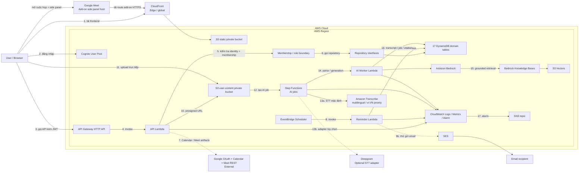

# Kiến trúc CampusMeet

## Trạng thái hiện tại

CampusMeet đang chuyển từ scaffold sang integration thật:

- frontend có application shell và mock data nghiệp vụ;
- Cognito sign-up, confirmation, sign-in, sign-out và protected route đã được triển khai/xác minh bằng auth integration stack; stack thử nghiệm trước đó đã cleanup;
- 17 bảng DynamoDB `campusmeet-dev-*` đã được tạo tại account `604360241374`, Region `ap-southeast-1`;
- CloudFormation ownership của 17 bảng chưa được xác nhận; cần verify schema rồi import/recreate theo runbook;
- backend nghiệp vụ chưa persistence thật: handler vẫn là skeleton và DynamoDB repository còn `NotImplementedError`;
- Google, reminder, hosting, observability và AI pipeline vẫn là kiến trúc mục tiêu/chưa chạy end-to-end.

“DynamoDB infrastructure đã tồn tại” và “application đã kết nối DynamoDB” là hai trạng thái khác nhau.

## Ranh giới source of truth

| File | Trách nhiệm |
| --- | --- |
| `infra/auth-integration.yaml` | Stack nhỏ để xác minh Cognito, HTTP API, `/health` và `/me` |
| `infra/data-foundation.yaml` | Mô hình nguồn của 17 bảng DynamoDB |
| `scripts/prepare-data-foundation.mjs` | Sinh template import/deploy có `Retain`, dependency tuần tự và import map |
| `infra/template.yaml` | Application stack mục tiêu, dùng bảng có sẵn qua `DataTablePrefix` |

Application stack không tạo DynamoDB table để tránh ownership trùng.

## Kiến trúc mục tiêu đã chốt



Luồng chính:

1. Browser tải static frontend qua CloudFront và S3 private.
2. Browser đăng nhập qua Cognito và nhận JWT theo flow đã chốt.
3. Browser gọi API Gateway bằng token Cognito.
4. API Gateway xác minh JWT và gọi API Lambda.
5. Lambda lấy identity từ claims đã xác minh; không tin `userId` do frontend gửi; use case group-scoped kiểm tra Memberships/role.
6. Handler gọi application/domain port; adapter DynamoDB thật chưa tồn tại ở baseline hiện tại.
7. Google Calendar dùng để tạo/sửa/hủy event và Meet link. Meet REST API là adapter hậu họp để lấy conference artifacts khi gói/quyền thực tế cho phép; nếu không có thì UI dùng upload/recording fallback.
8. EventBridge Scheduler gọi Reminder Lambda theo one-time schedule.
9. Reminder tạo in-app notification trước, sau đó mới thử gửi email SES.
10. API chỉ cấp presigned URL sau kiểm tra quyền và metadata.
11. Browser upload tài liệu/audio trực tiếp vào S3 user-content; file lớn không đi qua API Gateway/Lambda.
12. Upload hợp lệ tạo `AIJob`; Step Functions điều phối parse, STT, ingestion và generation bất đồng bộ.
13. `SpeechToTextProvider` xử lý ngôn ngữ đang nói; tiếng Việt là ngôn ngữ benchmark ưu tiên. Amazon Transcribe là adapter AWS mặc định, provider khác có thể thay thế theo cấu hình.
14. AI Worker gọi Amazon Bedrock. Model ID là cấu hình, không hard-code trong domain.
15. RAG dùng Bedrock Knowledge Bases + S3 Vectors với ba scope `CURRENT_MEETING`, `SELECTED_MEETINGS`, `WHOLE_GROUP`; mỗi query chỉ có một `groupId` và phải filter group/meeting-set/ACL/source status trước retrieval.
16. Transcript segment, job status, conversation metadata, task/tool proposal và group progress snapshot nằm trong DynamoDB; nội dung media nằm trong S3 private.
17. CloudWatch theo dõi core và AI pipeline; Alarm gửi cảnh báo qua SNS.
18. CampusMeet web vẫn là sản phẩm chính. Google Meet có thể tải một route side panel tối giản từ cùng CloudFront origin; route này lấy meeting context bằng Meet Add-ons SDK và gọi chung API/authorization, không có backend riêng.

CloudFront là edge/global service; các AWS service còn lại được đặt trong Region. MVP không đặt Lambda trong VPC và không dùng NAT Gateway để tránh chi phí, độ trễ và vận hành không cần thiết.

Sơ đồ là **target architecture**, không phải bằng chứng mọi resource đã deploy hoặc mọi feature đã tích hợp.

## Data foundation

17 bảng theo miền nghiệp vụ:

```text
users
groups
memberships
invitations
meetings
reminders
minutes
tasks
notifications
audit-logs
attachments
recordings
recording-consents
transcripts
ai-jobs
ai-conversations
tool-proposals
```

Prefix môi trường dev là `campusmeet-dev`.

- `infra/data-foundation.yaml` giữ tên bảng, key, GSI, TTL, SSE và tham số PITR/deletion protection.
- `scripts/prepare-data-foundation.mjs` sinh `.aws-sam/data-foundation.generated.json` với `DeletionPolicy: Retain`, `UpdateReplacePolicy: Retain` và dependency tuần tự để dùng khi validate/import/deploy.
- Script cũng sinh `.aws-sam/data-foundation-import.json` ánh xạ 17 logical resource với physical table name.
- `scripts/verify-data-foundation.ps1` là kiểm tra read-only cho account, Region, inventory, billing, key và GSI.
- RAG content không nằm trong DynamoDB; file/audio nằm ở S3 private, vector/metadata quyền nằm ở S3 Vectors.

Vertical slice persistence đầu tiên:

```text
POST /groups
  -> resolve Cognito identity
  -> validate CreateGroupRequest
  -> conditional write Groups + Memberships(GROUP_ADMIN)
  -> safe audit
  -> GET /groups qua UserMembershipsIndex
  -> cross-group denial test
```

Chỉ sau khi slice này chạy end-to-end mới đổi trạng thái “DynamoDB application integration” sang đã tích hợp một phần.

## Quyết định AI và Google đã chốt

- Không xây video call/WebRTC; Calendar API vẫn là luồng tạo event và Meet link.
- Meet REST API chỉ đồng bộ participants/recording/transcript khi artifact tồn tại và OAuth scope cho phép. MVP dùng nút đồng bộ hoặc polling AWS có giới hạn; không dùng Google Workspace Events vì notification endpoint yêu cầu Google Cloud Pub/Sub.
- Mỗi phiên họp phải khởi tạo live transcription chạy nền sau user gesture/consent và giữ hoạt động trong suốt phiên. Voice record/live transcript là nguồn duy nhất của nội dung phát biểu; agenda hoặc participant metadata không được dùng để suy đoán nội dung. Khi stream lỗi, các chức năng phụ thuộc nội dung bị khóa nhưng quản lý cuộc họp cơ bản vẫn hoạt động.
- STT giữ ngôn ngữ đang nói, ưu tiên chất lượng tiếng Việt và chỉ gắn `Speaker 1/2/...` ẩn danh; không có speaker-to-user mapping hoặc voice identity.
- Tài liệu có thể upload trước/trong/sau meeting. Chatbot current-meeting kết hợp document retrieval với segment final đọc trực tiếp từ transcript store; approved transcript/minutes mới ingest vào Knowledge Base cho selected/whole-group. Live source luôn được đánh dấu chưa duyệt.
- Biên bản AI ghi diễn biến/quyết định/action item đã được nêu. Task proposal có citation và chỉ gọi Task API sau preview, xác nhận, authorization và idempotency.
- RAG hỗ trợ current/selected/whole-group trong tối đa một group; không cross-group, reranking hoặc implicit filter trong MVP. Khi thiếu nguồn, trợ lý yêu cầu bổ sung hoặc báo không đủ căn cứ.
- Phân tích tiến độ chỉ diễn giải snapshot task/meeting cấp nhóm do backend tính; không đánh giá cá nhân và không gây mutation.
- CampusMeet không chuyển toàn bộ thành add-on và không nhúng giao diện Meet vào iframe thông thường. Meet Add-on chỉ là client surface tối giản trong side panel/main stage, dùng chung web assets, API, dữ liệu và authorization.
- MVP dùng deployment add-on chưa công bố để thử nghiệm. Private Marketplace chỉ dành cho cùng Google Workspace organization; public Marketplace cần Google review/OAuth verification phù hợp và không được làm chậm Core MVP.
- Panel trong CampusMeet web là fallback bắt buộc khi add-on chưa cài/bị quản trị viên chặn; Document PiP chỉ là progressive enhancement bổ sung.

## Nguyên tắc dữ liệu và quyền

- Timestamp lưu UTC; frontend hiển thị theo timezone người dùng.
- Một nhóm luôn có ít nhất một Group Admin.
- Chỉ active member được làm attendee hoặc assignee.
- Mọi thao tác group-scoped phải kiểm tra membership theo `groupId` sau khi xác thực danh tính.
- Một meeting có một organizer; Meet link chỉ hiện khi integration status là `READY`.
- Task overdue là dữ liệu tính toán, không phải một trạng thái task mới.
- `meetingStatus` và `googleSyncStatus` là hai state machine độc lập.
- Tài liệu, transcript, biên bản và vector đều mang `groupId`, `meetingId`, source status và ACL; filter group/meeting-set/quyền xảy ra trước retrieval.
- Audio, transcript và AI conversation có consent/retention; nội dung nhạy cảm không được ghi vào application log.
- Task/tool proposal không có quyền riêng; nó chỉ được thực thi bằng quyền hiện tại của người dùng đã xác nhận.
- Mutation quan trọng dùng conditional expression/idempotency; không trả raw DynamoDB item ngoài API contract.

Các quyết định cần nhóm chốt trước triển khai nằm trong [kế hoạch nhóm](ke-hoach-trien-khai-nhom.md). Chi tiết data/import nằm trong [runbook data foundation](huong-dan-data-foundation.md).
