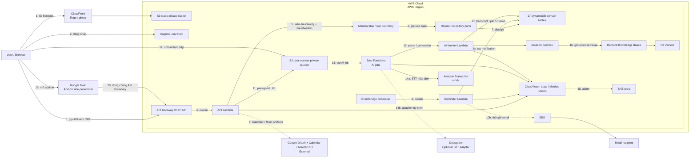

# Kiến trúc CampusMeet

## Trạng thái hiện tại

CampusMeet đang ở giai đoạn chuyển từ scaffold sang integration:

- frontend có application shell và mock data nghiệp vụ;
- Cognito sign-up, confirmation, sign-in, sign-out và protected route đã được triển khai/xác minh bằng auth integration stack;
- auth integration stack thử nghiệm trước đó đã cleanup;
- 17 bảng DynamoDB `campusmeet-dev-*` đã được tạo tại `ap-southeast-1`;
- backend chưa có persistence thật: handler nghiệp vụ vẫn là skeleton và DynamoDB repository còn `NotImplementedError`;
- Google OAuth/Calendar/Meet, reminder, email, frontend hosting, AI pipeline và observability chưa được triển khai end-to-end.

Vì vậy, “DynamoDB infrastructure đã tồn tại” và “application đã kết nối DynamoDB” là hai trạng thái khác nhau.

## Ranh giới các stack

| File | Trách nhiệm |
| --- | --- |
| `infra/auth-integration.yaml` | Stack nhỏ để xác minh Cognito, HTTP API, `/health` và `/me` |
| `infra/data-foundation.yaml` | Source of truth cho 17 bảng DynamoDB |
| `infra/template.yaml` | Application stack mục tiêu, dùng bảng có sẵn qua `DataTablePrefix` |

Application stack không tạo DynamoDB table để tránh trùng với data foundation.

## Kiến trúc mục tiêu



## Luồng request nghiệp vụ

1. Browser đăng nhập qua Cognito.
2. Browser gửi access token tới API Gateway.
3. API Gateway xác minh JWT.
4. Lambda lấy identity từ claims đã xác minh; không tin `userId` do frontend gửi.
5. Use case group-scoped kiểm tra Memberships theo `groupId`.
6. Handler gọi application service/domain port.
7. DynamoDB adapter thực hiện query/mutation có conditional expression/idempotency.
8. API trả DTO an toàn; không trả raw database item ngoài contract.
9. Audit log chỉ ghi metadata cần thiết, không chứa token hoặc dữ liệu nhạy cảm.

## Data foundation

17 bảng theo miền nghiệp vụ:

```text
users
groups
memberships
invitations
meetings
reminders
minutes
tasks
notifications
audit-logs
attachments
recordings
recording-consents
transcripts
ai-jobs
ai-conversations
tool-proposals
```

Prefix môi trường dev là `campusmeet-dev`.

SRS dùng multi-table design cho MVP để dễ phân chia việc, kiểm tra authorization và demo. RAG content không nằm trong DynamoDB; file/audio nằm ở S3 private, vector/metadata quyền nằm ở S3 Vectors.

Chi tiết primary key, GSI, TTL và import nằm trong [Hướng dẫn DynamoDB data foundation](huong-dan-data-foundation.md).

## Vertical slice triển khai đầu tiên

```text
POST /groups
  -> resolve Cognito user
  -> validate CreateGroupRequest
  -> conditional write Groups
  -> write Memberships(GROUP_ADMIN)
  -> audit
  -> return shared DTO
```

Tiếp theo:

```text
GET /groups
  -> query UserMembershipsIndex
  -> batch/read Groups
  -> chỉ trả nhóm người dùng đang active
```

Slice này là bằng chứng đầu tiên để đổi trạng thái “DynamoDB application integration” từ chưa triển khai sang đã tích hợp một phần.

## Quyết định AI và Google

- Không xây video call/WebRTC; Calendar API tạo event và Meet link.
- Meet REST API chỉ đồng bộ participant/recording/transcript khi artifact tồn tại và OAuth scope cho phép.
- Recording chỉ bắt đầu sau user gesture/consent và luôn hiển thị nguồn capture.
- Diarization tạo `Speaker 0/1/...`; người dùng có quyền mới ánh xạ sang thành viên.
- AI output là draft có citation; không đủ bằng chứng thì phải nói không xác định.
- Bedrock tool use chỉ tạo `ToolProposal`; mutation đi qua authorization, preview, xác nhận, idempotency và audit.
- CampusMeet web là sản phẩm chính; Meet Add-on chỉ là client surface tối giản dùng chung API.
- Panel trong CampusMeet web là fallback khi add-on chưa cài hoặc bị chặn.

## Nguyên tắc dữ liệu và quyền

- Timestamp lưu UTC; frontend hiển thị theo timezone người dùng.
- Một nhóm luôn có ít nhất một Group Admin.
- Chỉ active member được làm attendee hoặc assignee.
- Mọi thao tác group-scoped kiểm tra membership/role sau authentication.
- Một meeting có một organizer; Meet link chỉ hiện khi `googleSyncStatus = READY`.
- Task overdue là dữ liệu tính toán, không phải trạng thái lưu riêng.
- `meetingStatus`, `googleSyncStatus` và artifact status là các state machine độc lập.
- File/transcript/vector mang `groupId` và ACL; filter quyền xảy ra trước retrieval.
- Audio, transcript và AI conversation áp dụng consent/retention.
- Nội dung nhạy cảm không được ghi vào application log.
- Tool proposal chỉ được thực thi bằng quyền hiện tại của người dùng đã xác nhận.

## Vận hành và chi phí

- CloudFront là edge/global; phần còn lại đặt trong Region.
- MVP không đặt Lambda trong VPC và không dùng NAT Gateway.
- DynamoDB dùng `PAY_PER_REQUEST`.
- PITR và deletion protection là tham số, không tự bật cho dev.
- Không deploy data foundation vào tên bảng đã tồn tại trước khi verify/import.
- IAM developer không có quyền tạo/sửa/xóa table, IAM hoặc Billing.
- CloudTrail DynamoDB data events cần cấu hình riêng và có thể phát sinh phí.

Sơ đồ là **target architecture**. Resource tồn tại trên AWS không phải bằng chứng feature đã hoạt động end-to-end.
