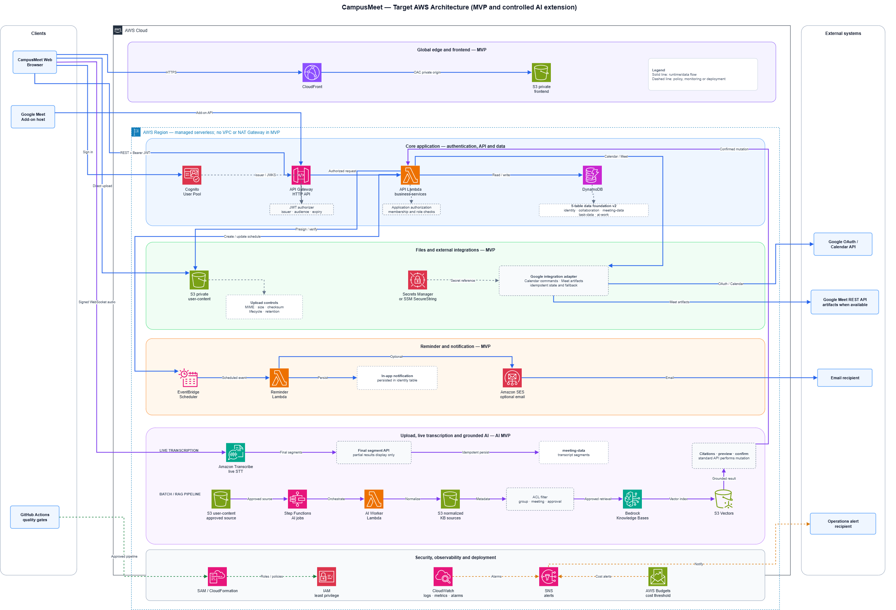
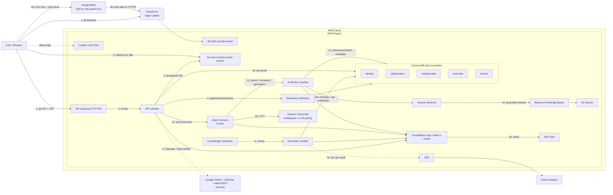

# Kiến trúc CampusMeet

## Trạng thái hiện tại

Repository đang chuyển từ scaffold sang các vertical slice thật:

- Cognito authentication đã được triển khai và kiểm thử bằng stack integration riêng; stack kiểm thử trước đó đã cleanup.
- Frontend auth, nhóm, lời mời, thông báo và CRUD cuộc họp đã gọi API thật; các domain còn lại vẫn đang hoàn thiện.
- M1 và lõi cuộc họp đã có API/repository DynamoDB thật; các domain còn lại vẫn có skeleton/TODO. Việc bảng tồn tại không đồng nghĩa mọi domain đã persistence thật.
- Mã nguồn/IaC của lõi cuộc họp chưa deploy lên account hiện tại và không tạo thêm bảng, index, Lambda, API Gateway hoặc Cognito.
- Nhóm đã chốt luồng upload an toàn, live transcription, AIJob, transcript, Bedrock RAG nhiều meeting và citation.
- Mô hình dữ liệu dùng 5 bảng vật lý đã deploy và verify, được định nghĩa tại `infra/data-foundation.yaml` và giải thích tại [Mô hình DynamoDB](dynamodb-data-model.md).

## Kiến trúc mục tiêu

Sơ đồ nguồn: [campusmeet-aws-architecture.drawio](architecture/campusmeet-aws-architecture.drawio).

## Luồng chính

1. Browser tải React assets qua CloudFront và S3 private.
2. Cognito xác thực người dùng; frontend gọi API Gateway bằng JWT.
3. API Gateway kiểm tra token trước khi invoke Lambda.
4. Lambda gọi application service và repository; backend luôn kiểm tra membership/role theo `groupId`.
5. Google Calendar tạo/sửa/hủy event và Meet link. Meet REST API chỉ lấy artifact khi artifact tồn tại và OAuth scope cho phép.
6. EventBridge Scheduler gọi Reminder Lambda theo one-time schedule.
7. Reminder đọc `meeting-data`, ghi notification vào `identity`, rồi thử gửi SES; email lỗi không rollback notification.
8. API cấp presigned URL sau khi kiểm tra membership, MIME, size, checksum và object key.
9. Browser upload binary trực tiếp vào S3; audio/file lớn không đi qua API Gateway hoặc Lambda payload.
10. Complete-upload hợp lệ tạo đúng một `AIJob` idempotent trong `ai-work`.
11. Step Functions điều phối parse, STT, ingestion và generation bất đồng bộ.
12. Live STT lưu chỉ final segment theo sequence; partial result chỉ hiển thị tạm.
13. AI Worker chuẩn hóa source, gọi Bedrock và cập nhật trạng thái an toàn.
14. Approved source được ingest vào Knowledge Base/S3 Vectors với filterable metadata `groupId`, `meetingId`, `sourceType`, `sourceId`, `version`, `approved`.
15. Conversation, citation, proposal, KnowledgeSource và AIJob control metadata nằm trong `ai-work`; binary và vector không nằm trong DynamoDB.
16. CloudWatch theo dõi core + AI pipeline và gửi cảnh báo qua SNS.

## Trách nhiệm của các thành phần

| Thành phần                              | Trách nhiệm                                                                                                                                     |
| --------------------------------------- | ----------------------------------------------------------------------------------------------------------------------------------------------- |
| CampusMeet Web                          | Giao diện chính cho nhóm, cuộc họp, biên bản, công việc, upload, transcript và AI.                                                              |
| Google Meet Add-on                      | Side panel dùng cùng frontend route, API, JWT, dữ liệu và quy tắc phân quyền với CampusMeet Web; không có kho dữ liệu hoặc business rule riêng. |
| CloudFront + S3 static                  | Phân phối frontend qua HTTPS. S3 static là private origin và chỉ CloudFront được đọc qua Origin Access Control.                                 |
| Cognito                                 | Đăng nhập, phát JWT và quản lý danh tính xác thực.                                                                                              |
| API Gateway                             | Kiểm tra chữ ký, issuer, audience/client, thời hạn JWT trước khi chuyển request vào backend.                                                    |
| API Lambda                              | Thực thi use case, kiểm tra quyền trên tài nguyên, điều phối repository và tích hợp ngoài.                                                      |
| DynamoDB                                | Lưu dữ liệu nghiệp vụ và trạng thái điều phối trong 5 bảng vật lý.                                                                              |
| S3 user-content                         | Lưu file, audio và artifact lớn; bucket private, truy cập qua URL có thời hạn.                                                                  |
| Step Functions + AI Worker              | Điều phối job dài, retry có kiểm soát, STT, chuẩn hóa, ingestion và sinh nội dung.                                                              |
| EventBridge Scheduler + Reminder Lambda | Chạy lịch nhắc một lần, tạo notification trong ứng dụng và thử gửi email.                                                                       |

## Xác thực và phân quyền

Xác thực JWT và phân quyền nghiệp vụ là hai lớp độc lập:

| Lớp kiểm tra | Nơi thực hiện                  | Nội dung kiểm tra                                                                                                                        |
| ------------ | ------------------------------ | ---------------------------------------------------------------------------------------------------------------------------------------- |
| Xác thực     | Cognito + API Gateway          | Token hợp lệ, đúng User Pool/client, chưa hết hạn và chữ ký đúng.                                                                        |
| Phân quyền   | API Lambda/application service | Người dùng còn là thành viên active, có role phù hợp, được truy cập`groupId`/`meetingId`/resource và phiên bản dữ liệu chưa bị thay đổi. |

JWT hợp lệ không tự động cho phép đọc hoặc sửa mọi dữ liệu. Backend phải kiểm tra membership trên từng thao tác group-scoped; attendee và assignee cũng phải là active member tại thời điểm ghi.

Mutation có nguy cơ gửi lặp dùng idempotency key. Cập nhật cạnh tranh dùng conditional write hoặc optimistic version; thay đổi nhiều item cần tính nguyên tử mới dùng DynamoDB transaction.

## Lưu file và xử lý bất đồng bộ

Binary không được lưu trong DynamoDB và không đi xuyên qua payload API/Lambda:

1. Client yêu cầu upload; backend kiểm tra membership, MIME, kích thước, checksum và sinh object key thuộc đúng group/meeting.
2. Backend cấp presigned URL ngắn hạn; client upload trực tiếp vào S3 private.
3. Client báo hoàn tất; backend dùng `HeadObject` để đối chiếu metadata/checksum trước khi ghi attachment hoặc recording metadata.
4. Nếu cần xử lý AI, backend tạo một `AIJob` idempotent rồi khởi chạy Step Functions.
5. Worker cập nhật trạng thái job theo từng bước; retry không tạo thêm job hoặc ghi trùng kết quả.

Bucket user-content phải có lifecycle/retention phù hợp với loại dữ liệu. Quyền tải xuống cũng được backend kiểm tra trước khi cấp URL; biết object key không đồng nghĩa có quyền đọc file.

## Ranh giới tích hợp ngoài

### Google Workspace

- CampusMeet không tự xây video call hoặc WebRTC. Calendar API là đường chính để tạo/cập nhật/hủy event và Meet link.
- Meet REST API chỉ đồng bộ participant, recording hoặc transcript khi artifact đã tồn tại và OAuth scope thực tế cho phép.
- Upload và live capture là fallback bắt buộc; luồng họp không phụ thuộc giả định rằng Google luôn trả transcript.
- Google adapter giữ logic OAuth, mapping trạng thái, idempotency và retry bên ngoài application service. Token/secret chỉ được tham chiếu từ nơi lưu bí mật, không ghi vào DynamoDB hoặc log.

### Email và dịch vụ AI

- Notification trong ứng dụng là dữ liệu chính. SES lỗi chỉ được retry/ghi nhận, không rollback notification đã tạo.
- Gọi Google, SES, Transcribe, Bedrock hoặc vector store dùng trạng thái + idempotency + retry; không giả lập distributed transaction qua nhiều dịch vụ.
- Kết quả AI luôn là draft có nguồn dẫn. Hành động làm thay đổi dữ liệu chỉ chạy sau bước preview, kiểm tra quyền và xác nhận của người dùng.

## Data foundation 5 bảng

| Bảng            | Aggregate chính                                                                                                         |
| --------------- | ----------------------------------------------------------------------------------------------------------------------- |
| `identity`      | User, preference, Google integration reference, OAuth state, notification                                               |
| `collaboration` | Group, membership, invitation, audit event                                                                              |
| `meeting-data`  | Meeting, attendee, agenda, minutes, reminder, attachment metadata, recording, consent, live session, transcript/segment |
| `task-data`     | Task và task history, index theo group/assignee/meeting                                                                 |
| `ai-work`       | AIJob, KnowledgeSource, conversation/message/citation, task/tool proposal, idempotency                                  |

Mỗi entity logic vẫn tồn tại. Việc gom bảng dùng composite `PK/SK`, sparse GSI và item collection; không nhồi toàn bộ project thành một item hoặc một partition.

`infra/data-foundation.yaml` là data stack độc lập. `infra/user-content-orchestration.yaml` là stack do M4 sở hữu cho S3 user-content, Step Functions, Reminder Lambda, Scheduler role và SES configuration set. `infra/template.yaml` là application stack; nó tham chiếu năm bảng qua `DataTablePrefix` và nhận outputs của stack M4 qua parameters, không tạo lại các resource đó.

## Quyết định AI và Google đã chốt

- Không xây video call/WebRTC; Calendar API vẫn là luồng tạo event và Meet link.
- Meet REST API chỉ đồng bộ participants/recording/transcript khi artifact và quyền thực tế cho phép; upload/recording fallback vẫn bắt buộc.
- Mỗi phiên họp khởi tạo live transcription sau user gesture/consent và hiển thị trạng thái `STARTING/ACTIVE/RECONNECTING/STOPPED/FAILED`.
- Voice/live transcript là nguồn nội dung phát biểu; agenda hoặc participant metadata không được dùng để suy đoán người dùng đã nói gì.
- MVP chỉ dùng Amazon Transcribe. Người dùng chọn `languageCode` trước phiên, frontend mặc định `vi-VN`; không có `AUTO`, không tự dịch và chỉ gắn `Speaker N`, không tự nhận diện danh tính.
- Partial transcript không lưu hoặc ingest. Final segment ghi idempotent theo `sessionId + sequence`/`ResultId`.
- Chat current-meeting có thể đọc final segment được phép trực tiếp; approved transcript/minutes/file mới ingest vào Knowledge Base cho selected/whole-group RAG.
- Retrieval luôn filter group/meeting-set/ACL/source status trước khi model nhận chunk.
- AI output là draft có citation. Task/tool proposal chỉ thực thi sau preview, authorization, optimistic version và idempotency.
- Phân tích tiến độ chỉ diễn giải snapshot task/meeting do backend tính; không đánh giá cá nhân.
- CampusMeet web là sản phẩm chính; Meet Add-on chỉ là client surface dùng chung API, data và authorization.

## Nguyên tắc dữ liệu và quyền

- Timestamp lưu UTC; frontend hiển thị theo timezone người dùng.
- Một group luôn có ít nhất một active Group Admin.
- Chỉ active member được làm attendee hoặc assignee.
- Mọi thao tác group-scoped kiểm tra membership sau khi xác thực JWT.
- Không dùng `Scan` trong request nghiệp vụ thông thường.
- Mutation nhiều item dùng conditional write/transaction; service ngoài dùng state + idempotency, không giả lập distributed transaction.
- File/audio/transcript/conversation áp dụng consent và retention; không ghi nội dung nhạy cảm vào application log.
- Lambda dùng IAM execution role; không hard-code AWS credential hoặc access key.
- Local test dùng in-memory repository hoặc DynamoDB Local; AWS dev dành cho integration test chung.

## Bảo mật, riêng tư và vận hành

- Lambda dùng execution role tối thiểu theo tài nguyên/hành động; không lưu hoặc chia sẻ access key dài hạn trong mã nguồn, file cấu hình hay tài liệu nhóm.
- S3 static và user-content đều private. Chỉ CloudFront OAC hoặc presigned URL đã được cấp quyền mới truy cập object.
- Recording, audio, transcript, file, conversation và Knowledge Source phải tuân theo consent, trạng thái phê duyệt và retention tương ứng.
- Log không chứa JWT/OAuth token, secret, presigned URL, nội dung file, toàn bộ transcript hoặc nội dung hội thoại. Chỉ ghi ID, trạng thái, mã lỗi và metadata cần cho chẩn đoán.
- CloudWatch theo dõi lỗi và độ trễ của API/Lambda, số job lỗi hoặc bị kẹt, upload không hoàn tất, lỗi reminder/Google/STT/Bedrock và Step Functions execution failure.
- Alarm nghiêm trọng gửi SNS; AWS Budgets cảnh báo chi phí môi trường dùng chung.

## CI/CD và ranh giới stack

GitHub Actions chạy quality gate, build và test cho pull request. Thay đổi hạ tầng được triển khai bằng CloudFormation/SAM theo trình tự: validate, xem change set, deploy và smoke test.

- Data stack sở hữu đúng 5 bảng DynamoDB và được triển khai độc lập để giảm rủi ro xóa dữ liệu khi cập nhật ứng dụng.
- Application stack sở hữu API, Lambda, workflow và các tài nguyên runtime; chỉ nhận tên bảng qua cấu hình môi trường.
- Cấu hình theo môi trường không hard-code trong source. Thay đổi production cần review change set và kế hoạch rollback.

Chi tiết câu lệnh triển khai, verify và rollback nằm trong [Hướng dẫn triển khai AWS](huong-dan-trien-khai-aws.md).

## Trình tự triển khai

1. Validate `infra/data-foundation.yaml`.
2. Preview change set trước khi cập nhật stack dữ liệu.
3. Verify schema, TTL, GSI và tag của 5 bảng.
4. Implement repository theo [mô hình 5 bảng](dynamodb-data-model.md).
5. Deploy application stack với cùng `DataTablePrefix`.
6. Smoke test core và luồng AI.

Sơ đồ trên là kiến trúc mục tiêu. Trạng thái triển khai thực tế phải được cập nhật bằng bằng chứng CloudFormation output, smoke test và logs; không suy ra chỉ từ việc template tồn tại.

## Tài liệu chi tiết liên quan

- Schema, key pattern, GSI và truy vấn: [Mô hình DynamoDB](dynamodb-data-model.md).
- Endpoint và request/response: [API contract](api-contract.md).
- Upload, live transcript, AIJob, RAG và citation: [Thiết kế kỹ thuật upload, live transcript và AI](thiet-ke-ky-thuat-upload-live-transcript-ai.md).
- Phạm vi công việc của từng thành viên: [Kế hoạch triển khai nhóm](ke-hoach-trien-khai-nhom.md).
- Cấu hình và vận hành AWS: [Hướng dẫn triển khai AWS](huong-dan-trien-khai-aws.md).

