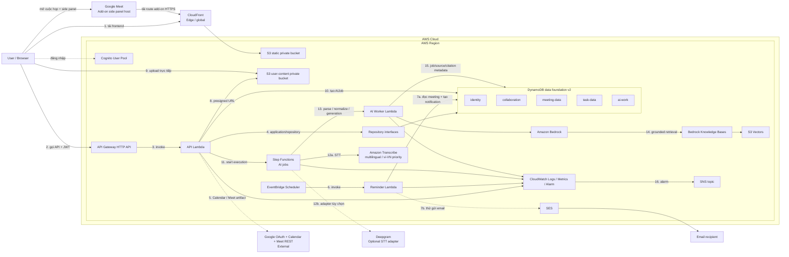

# Kiến trúc CampusMeet

## Trạng thái hiện tại

Repository đang chuyển từ scaffold sang các vertical slice thật:

- Cognito authentication đã được triển khai và kiểm thử bằng stack integration riêng; stack kiểm thử trước đó đã cleanup.
- Frontend nghiệp vụ vẫn còn mock ở nhiều màn hình.
- API nghiệp vụ và DynamoDB repositories vẫn còn skeleton/TODO; việc bảng tồn tại không đồng nghĩa backend đã persistence thật.
- Nhóm đã chốt phạm vi M5 gồm upload an toàn, live transcription, AIJob, transcript, Bedrock RAG nhiều meeting và citation.
- Account dev hiện có 17 bảng DynamoDB legacy được tạo trước khi data model được review. Các bảng này chưa phải source of truth mới và không được xóa trước audit/backup.
- Data model v2 dùng 5 bảng vật lý, được định nghĩa tại `infra/data-foundation.yaml` và giải thích tại [Mô hình DynamoDB v2](dynamodb-data-model.md).

## Kiến trúc mục tiêu

## Luồng chính

1. Browser tải React assets qua CloudFront và S3 private.
2. Cognito xác thực người dùng; frontend gọi API Gateway bằng JWT.
3. API Gateway kiểm tra token trước khi invoke Lambda.
4. Lambda gọi application service và repository; backend luôn kiểm tra membership/role theo `groupId`.
5. Google Calendar tạo/sửa/hủy event và Meet link. Meet REST API chỉ lấy artifact khi artifact tồn tại và OAuth scope cho phép.
6. EventBridge Scheduler gọi Reminder Lambda theo one-time schedule.
7. Reminder đọc `meeting-data`, ghi notification vào `identity`, rồi thử gửi SES; email lỗi không rollback notification.
8. API cấp presigned URL sau khi kiểm tra membership, MIME, size, checksum và object key.
9. Browser upload binary trực tiếp vào S3; audio/file lớn không đi qua API Gateway hoặc Lambda payload.
10. Complete-upload hợp lệ tạo đúng một `AIJob` idempotent trong `ai-work`.
11. Step Functions điều phối parse, STT, ingestion và generation bất đồng bộ.
12. Live STT lưu chỉ final segment theo sequence; partial result chỉ hiển thị tạm.
13. AI Worker chuẩn hóa source, gọi Bedrock và cập nhật trạng thái an toàn.
14. Approved source được ingest vào Knowledge Base/S3 Vectors với filterable metadata `groupId`, `meetingId`, `sourceType`, `sourceId`, `version`, `approved`.
15. Conversation, citation, proposal, KnowledgeSource và AIJob control metadata nằm trong `ai-work`; binary và vector không nằm trong DynamoDB.
16. CloudWatch theo dõi core + AI pipeline và gửi cảnh báo qua SNS.

## Data foundation 5 bảng

| Bảng | Aggregate chính |
| --- | --- |
| `identity` | User, preference, Google integration reference, OAuth state, notification |
| `collaboration` | Group, membership, invitation, audit event |
| `meeting-data` | Meeting, attendee, agenda, minutes, reminder, attachment metadata, recording, consent, live session, transcript/segment |
| `task-data` | Task và task history, index theo group/assignee/meeting |
| `ai-work` | AIJob, KnowledgeSource, conversation/message/citation, task/tool proposal, idempotency |

Mỗi entity logic vẫn tồn tại. Việc gom bảng dùng composite `PK/SK`, sparse GSI và item collection; không nhồi toàn bộ project thành một item hoặc một partition.

`infra/data-foundation.yaml` là data stack độc lập. `infra/template.yaml` là application stack và chỉ tham chiếu tên 5 bảng qua `DataTablePrefix`; nó không tạo lại DynamoDB tables.

## Quyết định AI và Google đã chốt

- Không xây video call/WebRTC; Calendar API vẫn là luồng tạo event và Meet link.
- Meet REST API chỉ đồng bộ participants/recording/transcript khi artifact và quyền thực tế cho phép; upload/recording fallback vẫn bắt buộc.
- Mỗi phiên họp khởi tạo live transcription sau user gesture/consent và hiển thị trạng thái `STARTING/ACTIVE/RECONNECTING/FAILED`.
- Voice/live transcript là nguồn nội dung phát biểu; agenda hoặc participant metadata không được dùng để suy đoán người dùng đã nói gì.
- STT giữ ngôn ngữ đang nói, ưu tiên chất lượng tiếng Việt và chỉ gắn `Speaker N`; không tự nhận diện danh tính.
- Partial transcript không lưu hoặc ingest. Final segment ghi idempotent theo `sessionId + sequence`/`ResultId`.
- Chat current-meeting có thể đọc final segment được phép trực tiếp; approved transcript/minutes/file mới ingest vào Knowledge Base cho selected/whole-group RAG.
- Retrieval luôn filter group/meeting-set/ACL/source status trước khi model nhận chunk.
- AI output là draft có citation. Task/tool proposal chỉ thực thi sau preview, authorization, optimistic version và idempotency.
- Phân tích tiến độ chỉ diễn giải snapshot task/meeting do backend tính; không đánh giá cá nhân.
- CampusMeet web là sản phẩm chính; Meet Add-on chỉ là client surface dùng chung API, data và authorization.

## Nguyên tắc dữ liệu và quyền

- Timestamp lưu UTC; frontend hiển thị theo timezone người dùng.
- Một group luôn có ít nhất một active Group Admin.
- Chỉ active member được làm attendee hoặc assignee.
- Mọi thao tác group-scoped kiểm tra membership sau khi xác thực JWT.
- Không dùng `Scan` trong request nghiệp vụ thông thường.
- Mutation nhiều item dùng conditional write/transaction; service ngoài dùng state + idempotency, không giả lập distributed transaction.
- File/audio/transcript/conversation áp dụng consent và retention; không ghi nội dung nhạy cảm vào application log.
- Lambda dùng IAM execution role; không hard-code AWS credential hoặc access key.
- Local test dùng in-memory repository hoặc DynamoDB Local; AWS dev dành cho integration test chung.

## Trình tự triển khai

1. Audit 17 bảng legacy ở chế độ read-only.
2. Backup/export nếu có dữ liệu.
3. Deploy data stack v2 tạo 5 bảng mới.
4. Verify schema, TTL, GSI và tag.
5. Implement repository theo [mô hình v2](dynamodb-data-model.md).
6. Deploy application stack với cùng `DataTablePrefix`.
7. Smoke test core + M5.
8. Chỉ sau khi không còn code đọc/ghi legacy mới xóa bảng cũ.

Sơ đồ trên là kiến trúc mục tiêu. Trạng thái triển khai thực tế phải được cập nhật bằng bằng chứng CloudFormation output, smoke test và logs; không suy ra chỉ từ việc template tồn tại.
