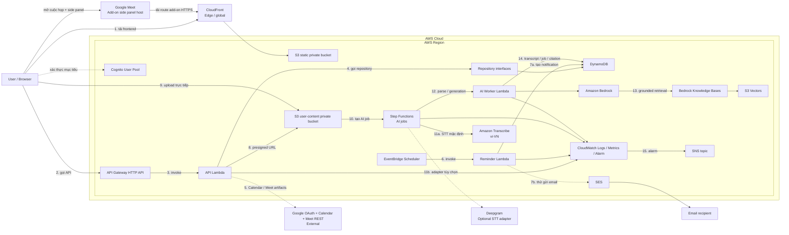

# Kiến trúc CampusMeet

## Trạng thái hiện tại

Repository mới có application shell, mock data, shared contracts, Lambda handler skeleton và AWS SAM skeleton. Chỉ `GET /health` có xử lý thật ở mức tối thiểu; API nghiệp vụ, Cognito, DynamoDB, Google, reminder và email chưa được kết nối. Chưa có AWS resource nào được deploy.

## Kiến trúc mục tiêu đã chốt

Luồng chính:

1. Browser tải static frontend qua CloudFront và S3 private.
2. Browser gọi API Gateway bằng token Cognito ở giai đoạn triển khai thật.
3. API Gateway gọi API Lambda.
4. Lambda gọi repository interface; adapter DynamoDB thật chưa tồn tại.
5. Google Calendar dùng để tạo/sửa/hủy event và Meet link. Meet REST API là adapter hậu họp để lấy conference artifacts khi gói/quyền thực tế cho phép; nếu không có thì UI dùng upload/recording fallback.
6. EventBridge Scheduler gọi Reminder Lambda theo one-time schedule.
7. Reminder tạo in-app notification trước, sau đó mới thử gửi email SES.
8. API chỉ cấp presigned URL sau kiểm tra quyền và metadata.
9. Browser upload tài liệu/audio trực tiếp vào S3 user-content; file lớn không đi qua API Gateway/Lambda.
10. Upload hợp lệ tạo `AIJob`; Step Functions điều phối parse, STT, ingestion và generation bất đồng bộ.
11. Amazon Transcribe `vi-VN` là STT mặc định; Deepgram chỉ là adapter thay thế sau benchmark.
12. AI Worker gọi Amazon Bedrock. Model ID là cấu hình, không hard-code trong domain.
13. RAG dùng Bedrock Knowledge Bases + S3 Vectors, bắt buộc filter `groupId`/ACL trước retrieval và trả citation.
14. Transcript segment, job status, conversation metadata và tool proposal nằm trong DynamoDB; nội dung media nằm trong S3 private.
15. CloudWatch theo dõi core và AI pipeline; Alarm gửi cảnh báo qua SNS.
16. CampusMeet web vẫn là sản phẩm chính. Google Meet có thể tải một route side panel tối giản từ cùng CloudFront origin; route này lấy meeting context bằng Meet Add-ons SDK và gọi chung API/authorization, không có backend riêng.

CloudFront là edge/global service; các AWS service còn lại được đặt trong Region. MVP không đặt Lambda trong VPC và không dùng NAT Gateway để tránh chi phí, độ trễ và vận hành không cần thiết.

Sơ đồ là **target architecture**, không phải bằng chứng đã deploy hoặc đã tích hợp Google/AWS.

## Quyết định AI và Google đã chốt

- Không xây video call/WebRTC; Calendar API vẫn là luồng tạo event và Meet link.
- Meet REST API chỉ đồng bộ participants/recording/transcript khi artifact tồn tại và OAuth scope cho phép. MVP dùng nút đồng bộ hoặc polling AWS có giới hạn; không dùng Google Workspace Events vì notification endpoint yêu cầu Google Cloud Pub/Sub.
- Recording chỉ bắt đầu sau user gesture/consent và phải hiển thị nguồn capture. Microphone không được xem là bằng chứng đã thu toàn bộ âm thanh từ Google Meet.
- Diarization tạo `Speaker 0/1/...`; người dùng ánh xạ sang thành viên. LLM không tự đoán danh tính.
- AI output là draft có citation. Bedrock tool use chỉ tạo `ToolProposal`; mọi mutation đi qua authorization, preview, xác nhận, idempotency và audit của API nghiệp vụ.
- CampusMeet không chuyển toàn bộ thành add-on và không nhúng giao diện Meet vào iframe thông thường. Meet Add-on chỉ là client surface tối giản trong side panel/main stage, dùng chung web assets, API, dữ liệu và authorization.
- MVP dùng deployment add-on chưa công bố để thử nghiệm. Private Marketplace chỉ dành cho cùng Google Workspace organization; public Marketplace cần Google review/OAuth verification phù hợp và không được làm chậm Core MVP.
- Panel trong CampusMeet web là fallback bắt buộc khi add-on chưa cài/bị quản trị viên chặn; Document PiP chỉ là progressive enhancement bổ sung.

## Nguyên tắc dữ liệu và quyền

- Timestamp lưu UTC; frontend hiển thị theo timezone người dùng.
- Một nhóm luôn có ít nhất một Group Admin.
- Chỉ active member được làm attendee hoặc assignee.
- Mọi thao tác group-scoped phải kiểm tra membership theo `groupId` sau khi xác thực danh tính.
- Một meeting có một organizer; Meet link chỉ hiện khi integration status là `READY`.
- Task overdue là dữ liệu tính toán, không phải một trạng thái task mới.
- `meetingStatus` và `googleSyncStatus` là hai state machine độc lập.
- File/transcript/vector đều mang `groupId` và ACL; filter quyền xảy ra trước retrieval.
- Audio, transcript và AI conversation có consent/retention; nội dung nhạy cảm không được ghi vào application log.
- Tool proposal không có quyền riêng; nó chỉ được thực thi bằng quyền hiện tại của người dùng đã xác nhận.

Các quyết định cần nhóm chốt trước triển khai nằm trong [kế hoạch nhóm](ke-hoach-trien-khai-nhom.md).
