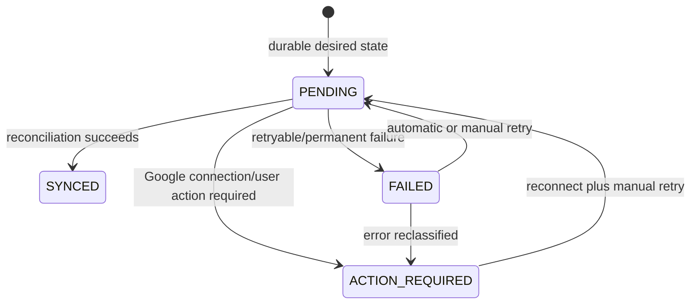
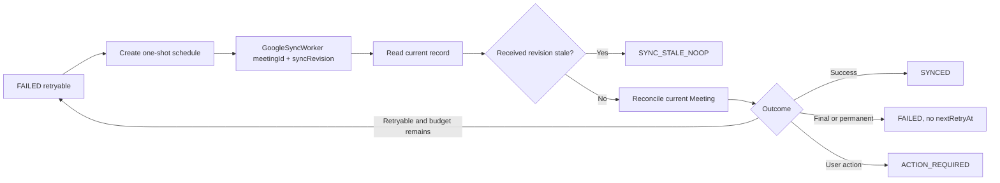

# M2–M4 Google Meeting synchronization runtime contract

## Status

ACCEPTED

Accepted runtime design date: 2026-08-07

Source implementation status: IMPLEMENTED and LOCAL VERIFIED on 2026-08-07. AWS verification status: NOT YET COMPLETE. Browser verification status: HUMAN VERIFICATION PENDING.

## 1. Context

M2 owns the internal Meeting lifecycle. M4 integrates that Meeting with the organizer's Google Calendar and Google Meet. Google is an external dependency and cannot participate in an atomic transaction with DynamoDB. Decision 4A therefore commits internal state and a durable synchronization intent together, then reconciles Google asynchronously.

This record supersedes the earlier principle-only design and closes the previously unresolved runtime details. It is the implementation contract, not evidence that runtime code or AWS resources already exist.

### Repository maturity

The implementation branch now contains `GoogleMeetingSyncRecord` persistence, atomic Meeting + sync-intent transactions, `syncRevision`, a DynamoDB Stream worker, current-state Calendar reconciliation, bounded Scheduler retries, the manual retry route, read-side summary, frontend states, and corresponding IaC and automated tests. The former synchronous Calendar create path has been removed.

The implementation reuses OAuth/token persistence in the `identity` table and the one-shot Reminder Scheduler conventions without changing their ownership. Local source/test evidence is not AWS evidence: deployment, Stream delivery, Scheduler invocation, real Google reconciliation, and browser behavior remain unverified.

## 2. Scope

This contract covers Meeting create, relevant update, cancel, initial asynchronous processing, stale-work protection, idempotency, automatic and manual retry, user-visible integration state, security, observability, and mapping to the existing five-table data foundation.

## 3. Source of truth

The M2 Meeting is the source of truth for the internal lifecycle: `SCHEDULED`, `COMPLETED`, or `CANCELLED`. Google synchronization neither owns nor changes that lifecycle. A successful internal create, update, or cancel is never rolled back because Google synchronization fails.

## 4. Ownership

M2 owns the Meeting domain, lifecycle, agenda, attendees, `organizerId`, Meeting `version`, and Meeting authorization. M4 owns Google Calendar/Meet integration state, `googleEventId`, `meetUrl`, sync status and revision, retry metadata, Google error classification, and OAuth behavior.

The authenticated creator is the organizer in the MVP. Organizer reassignment is unsupported. M4 uses the organizer's Google account connection. OAuth access/refresh tokens are never stored in the Meeting or synchronization record.

## 5. Persistence model

`GoogleMeetingSyncRecord` is a separate logical entity in the existing physical `campusmeet-<env>-meeting-data` table:

```text
PK=MEETING#<meetingId>
SK=INTEGRATION#GOOGLE
entityType=GoogleMeetingSyncRecord
```

It is colocated with `PK=MEETING#<meetingId>, SK=META`, allowing one DynamoDB transaction. It has no TTL and requires no new GSI. The logical fields are:

| Field                                 | Contract                                                                 |
| ------------------------------------- | ------------------------------------------------------------------------ |
| `meetingId`, `groupId`, `organizerId` | Trusted M2 identity/scope fields                                         |
| `provider`                            | Constant `GOOGLE`                                                        |
| `syncStatus`                          | `PENDING`, `SYNCED`, `FAILED`, or `ACTION_REQUIRED`                      |
| `syncRevision`                        | Monotonic M4 desired-state revision                                      |
| `desiredMeetingVersion`               | M2 version used for trace/reconcile                                      |
| `desiredMeetingStatus`                | Desired current M2 lifecycle snapshot                                    |
| `googleEventId?`, `meetUrl?`          | M4-owned trusted Google references                                       |
| `attemptCount`                        | Attempts for the current revision; initial attempt is `1` when it starts |
| `failureClass?`                       | `RETRYABLE`, `ACTION_REQUIRED`, or `PERMANENT`                           |
| `lastErrorCode?`, `lastErrorAt?`      | Safe normalized category and timestamp; never a raw Google body          |
| `nextRetryAt?`                        | Present only while an automatic retry remains scheduled                  |
| `createdAt`, `updatedAt`              | UTC ISO 8601 timestamps                                                  |

Absent optional attributes are omitted, matching the repository's `removeUndefinedValues` convention. Raw Google response/error bodies are not persisted. Google connection metadata/secret references remain in `identity` at `USER#<organizerId> / INTEGRATION#GOOGLE`.

## 6. Atomic mutation and synchronization intent

Every Meeting mutation requiring Google synchronization uses one DynamoDB `TransactWriteItems` against `meeting-data`:

1. Create/update/cancel the M2 Meeting aggregate with its existing conditions.
2. Put/update `GoogleMeetingSyncRecord` to `PENDING`, increment `syncRevision`, set the desired Meeting version/status, reset attempt and failure metadata, and preserve trusted external identifiers when already known.

The API succeeds after that internal transaction commits. Google API calls are never in this synchronous critical path. The implementation must account for DynamoDB's transaction item limit after adding the sync record, including Meeting create/update with attendee and agenda items.

## 7. Asynchronous processing

The initial attempt is triggered by a DynamoDB Stream on `campusmeet-<env>-meeting-data`. The implementation PR enables the stream with `NEW_AND_OLD_IMAGES` and adds an event-source filter that admits `INSERT`/`MODIFY` records whose new image has `entityType=GoogleMeetingSyncRecord`, `provider=GOOGLE`, and `syncStatus=PENDING`. This docs PR does not enable it.

The stream adapter invokes `GoogleSyncWorker` with only stable work identity, at minimum `meetingId` and the new image's `syncRevision`. The worker may use `groupId` for correlation but must reread the current Meeting and current sync record. DynamoDB Streams are at-least-once and may deliver out of order; duplicate delivery is safe because every invocation performs the revision guard and idempotent reconciliation.

## 8. Synchronization state machine



- `PENDING`: intent is durable and waiting/running.
- `SYNCED`: Google matches the desired current Meeting state.
- `FAILED`: attempt failed. `nextRetryAt` is present only when an automatic retry remains; it is absent after exhaustion or permanent failure.
- `ACTION_REQUIRED`: automation cannot continue until user action, such as reconnecting Google. No automatic retry occurs.

There is no `RETRYING` status; an active attempt is `PENDING`. No Google status transition changes `Meeting.status`.

## 9. `syncRevision` and stale-work protection

`syncRevision` is monotonic and separate from M2 optimistic-concurrency `Meeting.version`. Create, each Google-relevant update, cancel, and manual retry increment it. `desiredMeetingVersion` is trace metadata only.

Before any Google call the worker strongly reads the latest sync record and compares the received revision:

- received revision less than current: `SYNC_STALE_NOOP`; do not call Google, write status, or schedule retry;
- received revision equal to current: reread the current Meeting and reconcile;
- received revision greater than current: invalid work; fail safely and alert, without calling Google.

All worker status updates are conditional on the same current `syncRevision`, so a newer mutation cannot be overwritten while an older invocation is in flight.

## 10. Reconciliation semantics

The worker never blindly replays an old operation payload. It reads the current Meeting and sync record and converges Google to current desired state:

- current Meeting `SCHEDULED`: exactly one active Google event exists and reflects the latest title, time, agenda, and attendees;
- current Meeting `CANCELLED`: the mapped Google event is cancelled/deleted according to the M4 adapter contract; absence is already converged;
- current Meeting `COMPLETED`: no lifecycle mutation is caused by M4; implementation must not recreate a cancelled event and must follow the latest durable desired state.

## 11. Create sequence

```mermaid
sequenceDiagram
    actor User
    participant API as Meeting API / M2
    participant DDB as meeting-data transaction
    participant Stream as DynamoDB Stream
    participant Worker as M4 GoogleSyncWorker
    participant Google as Google Calendar API
    User->>API: Create Meeting
    API->>API: Authenticate, authorize, validate
    API->>DDB: Meeting + SyncRecord(PENDING, revision)
    DDB-->>API: Commit
    API-->>User: Meeting success
    DDB-->>Stream: SyncRecord change
    Stream-->>Worker: meetingId + syncRevision
    Worker->>Worker: Read current Meeting + SyncRecord; stale guard
    Worker->>Google: Reconcile current desired state
    Google-->>Worker: Success or classified failure
    Worker->>DDB: SYNCED / FAILED / ACTION_REQUIRED
```

A Google failure never travels backward to delete or roll back the Meeting.

## 12. Update and cancel semantics

For update, `PATCH` with required Meeting version `N` passes M2 authorization and optimistic concurrency; the transaction persists Meeting `N+1` and a new sync revision. The API returns internal success, and M4 reconciles asynchronously. Google failure does not roll back `version`, title, time, agenda, or attendees.

For cancel, the transaction first makes the durable desired internal outcome `Meeting.status=CANCELLED` and creates a new sync revision. Google cancellation is asynchronous. Failure leaves the Meeting cancelled and retry continues reconciling cancellation.

## 13. Organizer and Google identity

M4 always uses the creator/organizer's Google connection. A Meeting is still created if no connection exists. Missing connection produces `ACTION_REQUIRED`, `failureClass=ACTION_REQUIRED`, and safe code `GOOGLE_CONNECTION_REQUIRED`. Revoked/invalid consent behaves likewise. Reconnection does not itself mutate Meeting lifecycle; a Group Admin starts a manual retry afterward.

## 14. Idempotency and external identity

One CampusMeet Meeting maps to at most one active Google Calendar event for its organizer. The implementation PR must choose and test one adapter technique:

1. Preferred: derive a deterministic, stable, Google-valid client-supplied event identity from `meetingId`; exact encoding remains adapter-private.
2. Fallback if the API/adapter cannot supply that ID: attach stable CampusMeet Meeting identity in Google private metadata, look up/reconcile by it before insert, and never blindly insert on retry.

`googleEventId` is stored only after a trusted Google response and remains stable. Duplicate stream delivery, Lambda retry, Scheduler retry, timeout after an ambiguous Google response, and manual retry must all preserve the at-most-one-active-event invariant.

## 15. Automatic retry

The initial Stream-triggered attempt is followed by at most five EventBridge Scheduler one-shot retries:

| Automatic retry | Delay after failed attempt |
| --------------: | -------------------------: |
|               1 |                   1 minute |
|               2 |                  5 minutes |
|               3 |                 15 minutes |
|               4 |                     1 hour |
|               5 |                    6 hours |

The scheduled target payload contains at minimum `meetingId` and `syncRevision`, never a serialized Meeting. A stable schedule identity derived from meeting/revision/retry ordinal makes schedule creation/execution idempotent. Before scheduling and on execution, conditional revision checks prevent a stale retry from changing state. After retry 5 fails, status remains `FAILED`, `nextRetryAt` is omitted, and automatic retry stops.



## 16. Failure classification

| `failureClass`    | Examples                                                                                                       | Result                                          |
| ----------------- | -------------------------------------------------------------------------------------------------------------- | ----------------------------------------------- |
| `RETRYABLE`       | Network timeout, transient dependency failure, semantic Google 429/rate-limit, Google 5xx                      | `FAILED`; schedule next retry if budget remains |
| `ACTION_REQUIRED` | Missing connection, revoked consent, invalid/revoked refresh credential, explicit auth error needing reconnect | `ACTION_REQUIRED`; no automatic retry           |
| `PERMANENT`       | Invalid business payload, unsupported state, non-auth permanent external validation                            | `FAILED`; no automatic retry                    |

The adapter classifies actual Google error semantics; it must not blanket-classify every HTTP 403. Only normalized safe error codes reach persistence/logs/UI.

## 17. Manual retry

Target route: `POST /meetings/{meetingId}/google-sync/retry`. It requires authentication, active membership in the Meeting's group, and Group Admin permission under M2 mutation policy.

The operation reads the current Meeting and sync record, does not change Meeting lifecycle, increments `syncRevision`, sets `PENDING`, resets `attemptCount` to `0`, clears `failureClass`, `lastErrorCode`, `lastErrorAt`, and `nextRetryAt`, and records desired version/status from the current Meeting. The durable record change triggers the Stream. Historical Meeting payload is never accepted. For `ACTION_REQUIRED`, retry is useful only after the organizer's connection is restored.

## 18. UX and read-side contract

Meeting detail exposes a separate read-only Google integration summary. Internal Meeting state remains visible regardless of sync result.

- `PENDING`: “Google Meet đang được đồng bộ.”
- `SYNCED`: show a trusted `meetUrl` when present and CTA “Tham gia Google Meet”.
- `FAILED`: “Đồng bộ Google Calendar/Meet thất bại.”; authorized users may retry.
- `ACTION_REQUIRED`: “Cần kết nối lại tài khoản Google để đồng bộ cuộc họp.”

Google failure is not presented as Meeting create/update/cancel failure. Only valid trusted integration state exposes `meetUrl`.

## 19. Security

- Never store plaintext Google credentials in Meeting/sync record, return them to frontend, or log them.
- Never log access/refresh tokens, Authorization headers, JWTs, client secrets, presigned credentials, or raw credential objects.
- Client input cannot set `googleEventId`, `meetUrl`, `syncRevision`, `syncStatus`, or `attemptCount`.
- Manual retry authorization is enforced server-side through the M2 Meeting access boundary; `groupId` is resolved from the Meeting, not trusted from the client.
- `googleEventId` and `meetUrl` come only from the trusted adapter response.

## 20. Observability

Structured worker logs correlate `requestId` or `correlationId`, `meetingId`, appropriate `groupId`, `syncRevision`, desired operation/state, `attemptCount`, `syncStatus`, `failureClass`, safe Google error code/category, and latency. CloudWatch must distinguish semantic events equivalent to `SYNC_SUCCESS`, `SYNC_RETRY_SCHEDULED`, `SYNC_ACTION_REQUIRED`, `SYNC_FAILED_FINAL`, and `SYNC_STALE_NOOP`.

The implementation adds a dedicated GoogleSyncWorker log group, error/duration alarms, and metrics/filters as appropriate to the repository convention. Logs contain metadata, never secrets or raw provider bodies.

## 21. AWS infrastructure mapping

| Accepted component | Implemented source mapping                                                                                                                                                                                               | Verification status                            |
| ------------------ | ------------------------------------------------------------------------------------------------------------------------------------------------------------------------------------------------------------------------ | ---------------------------------------------- |
| Persistence        | `GoogleMeetingSyncRecord` at `MEETING#<meetingId>/INTEGRATION#GOOGLE` in `MeetingDataTable`; no sixth table                                                                                                              | Locally tested; AWS pending                    |
| Initial trigger    | `MeetingDataTable` `NEW_AND_OLD_IMAGES` Stream plus filtered `INSERT`/`MODIFY` event source mapping for pending Google records                                                                                           | IaC validated; AWS pending                     |
| Worker             | `GoogleSyncWorker` Lambda normalizes Stream/Scheduler input, rereads current records, guards revisions, and reconciles current desired state                                                                             | Locally tested; AWS pending                    |
| Retry              | Google-specific one-shot Scheduler adapter uses deterministic names, `at(...)`, `FlexibleTimeWindow=OFF`, `ActionAfterCompletion=DELETE`, identity-only payload, Google worker target, and zero Scheduler target retries | Locally tested; AWS pending                    |
| API                | Authenticated proxy route `POST /meetings/:meetingId/google-sync/retry` and read-only Meeting detail summary                                                                                                             | Locally tested; AWS/browser pending            |
| Google             | Existing adapter refactored to deterministic event identity and idempotent ensure-scheduled/ensure-cancelled reconciliation                                                                                              | Adapter tested with fakes; real Google pending |
| OAuth              | Existing Google connection/token refresh repository in `identity`; credentials remain excluded from Meeting/sync DTOs and structured logs                                                                                | Locally audited; AWS pending                   |
| Monitoring         | Structured semantic events and EMF metrics, dedicated worker log group, and final-failure alarm                                                                                                                          | IaC validated; AWS pending                     |

No SQS or Step Functions is introduced for this contract.

## 22. Deployment and verification prerequisites

1. Review and merge the source/IaC implementation.
2. Identify a verified project DEV AWS identity and deploy through the repository-supported process.
3. Verify Stream delivery, Lambda state, Scheduler permissions, CloudWatch semantics, and no seventh external attempt.
4. Exercise missing/revoked connection, real Google create/update/cancel, at-most-one-event, and manual retry with safe test accounts.
5. Complete authenticated browser review; do not treat local component tests as browser evidence.

## 23. Implementation acceptance tests

### Create

- [ ] Meeting persists before Google result.
- [ ] Sync intent persists durably.
- [ ] Google success → `SYNCED`.
- [ ] Google transient failure → `FAILED` + retry.
- [ ] Google auth failure → `ACTION_REQUIRED`.
- [ ] Google failure does not remove Meeting.
- [ ] Duplicate delivery does not create duplicate Google event.

### Update

- [ ] Required Meeting version still enforced.
- [ ] Internal update succeeds independently of Google.
- [ ] `syncRevision` increments.
- [ ] Stale worker no-op.
- [ ] External state reconciles to newest Meeting.

### Cancel

- [ ] Internal Meeting becomes `CANCELLED` first.
- [ ] Google cancel failure does not restore `SCHEDULED`.
- [ ] Retry eventually reconciles cancel.

### Retry

- [ ] Retry delays match 1m/5m/15m/1h/6h.
- [ ] No more than five automatic retries.
- [ ] Retry payload only uses stable identity/revision.
- [ ] Exhaustion leaves `FAILED`.
- [ ] Manual retry works from current Meeting state.

### Security

- [ ] No OAuth token in Meeting.
- [ ] No secret in logs.
- [ ] Client cannot override trusted sync fields.
- [ ] Manual retry authorization enforced.

### Observability

- [ ] CloudWatch can trace `meetingId` + `syncRevision` + attempt.
- [ ] Success/retry/action-required/final-failure/stale-noop are observable.

## 24. Known limitations

- Google propagation and conference creation may remain temporarily asynchronous after an API success.
- A `SYNCED` Calendar event does not guarantee that every optional Meet artifact exists or is accessible.
- `ACTION_REQUIRED` needs organizer reconnection and a subsequent authorized manual retry.
- Exactly-once delivery is not assumed; correctness comes from revision guards and idempotent reconciliation.
- Organizer reassignment is outside the MVP.

## 25. Out of scope

Production deployment, destructive legacy-field migration, a sixth DynamoDB table, a new OAuth store, frontend-editable trusted integration fields, SQS/Step Functions replacement, production smoke data, and removal of legacy persisted values remain out of scope. This implementation branch changes source and IaC but has not deployed or mutated AWS resources.
